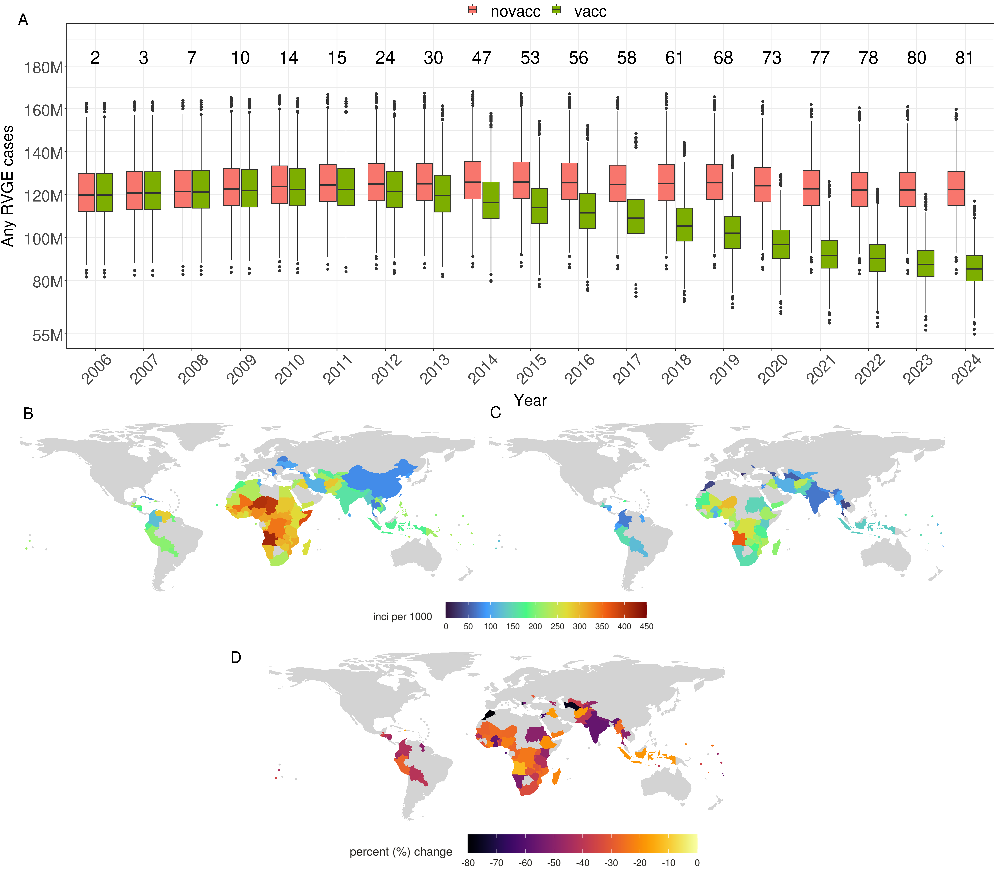

# Rotavirus-LMICs

## Manuscript

**Quantifying and Identifying Strategies to Improve Rotavirus Vaccine Impact in Low- and Middle-Income Countries**

**First author:** Ernest O. Asare

## Summary

This repository contains the MATLAB code and model data used to quantify rotavirus vaccine impact and evaluate strategies to improve vaccination outcomes in low- and middle-income countries (LMICs).

The model estimates the historical impact of rotavirus vaccination from 2006–2024 and projects its potential impact under different vaccination strategies from 2025–2034. It evaluates different vaccination schedules and coverage over the 10-year projection period. The model incorporates country-specific vaccination coverage, vaccination status, demographic characteristics, and population age distributions across 112 low- and middle-income countries (LMICs).

## Results

The repository contains a figure showing the historical impact of rotavirus vaccination across the 112 LMICs from 2006 to 2024.

### Historical Rotavirus Vaccine Impact

**Fig. 2. Impact of the historical rotavirus vaccination program across 112 LMICs from 2006 to 2024.** (A) Box plots of annual model-simulated RVGE cases with vaccination (green) and without vaccination (red) across all LMICs. Values above the plots indicate the cumulative number of countries that introduced the vaccine by each year. Spatial distribution of model-predicted RVGE incidence (per 1,000 person-years) in (B) the absence of vaccination and (C) with vaccination for countries that have introduced the vaccine. (D) Percent reduction in RVGE incidence due to vaccination among countries that implemented the vaccine. For each country, the percent change is calculated from the year of vaccine introduction through the end of 2024.



## Repository Structure

```text
Rotavirus-LMICs/
│
├── README.md
│
├── figures/
│   └── Figure2.png
│
├── main_model_112_LMICs.m
├── ode_equations.m
├── icountry_order.xlsx
│
├── fixed_parameters_for_all_countries_1000_sim.mat
├── vaccine_coverage.mat
├── demographic_data_1980_2060.mat
├── current_vacc_status_1000_sim.mat
│
├── all_uses_6_10_14_sch_1000_sim.mat
├── all_switch_to_6_10_sch_1000_sim.mat
└── all_keep_current_vacc_status_1000_sim.mat
```

All required model files are placed in the same directory.

## Model Execution Workflow

1. **Open MATLAB**
2. **Set the Current Folder**
   - Set `Rotavirus-LMICs` as the current folder.
3. **Check Input Files**
   - Verify that all required input files are present.
4. **Open the Main Script**
   - Open `main_model_112_LMICs.m`.
5. **Configure `icountry`**
   - Configure `icountry` if a specific country is required.
6. **Run the Model**
   - Run `main_model_112_LMICs.m`.
7. **Default Execution**
   - By default, the model loops over all **112 LMICs**.
8. **Simulation Outputs**
   - Country-specific simulation output files are generated.

## Model Population

The model includes **112 low- and middle-income countries (LMICs)**.

Country-specific vaccination, demographic, and population age-distribution data are incorporated into the model to quantify historical vaccine impact and project vaccine impact under different vaccination scenarios.

## Model Scenarios

The model evaluates rotavirus vaccine impact under different vaccination scenarios.

### Current Vaccination Status

- Countries maintain their vaccination status as of **December 2024**.
- The projection begins in **January 2025**, with countries maintaining their 2024 vaccination status.

### Three-Dose Schedule

- All countries use a three-dose vaccination schedule at **6, 10, and 14 weeks**.

### Two-Dose Schedule

- All countries use a two-dose vaccination schedule at **6 and 10 weeks**.

### Vaccination Suspension

For the vaccination suspension scenario, from **2025 onward**, the following vaccination-related parameters are set to zero:

- Vaccine-induced response rates
- Duration of vaccine-induced immunity
- Vaccination coverage

### 95% Scaled-Up Coverage

For the 95% scaled-up coverage scenario:

- Projected vaccine coverage is set to **0.95 (95%)** from 2025 onward.

## Model Data and Code Description
The following files contain the model code, input data, model parameters, country ordering, and scenario-specific data used to generate the model results.

## Model Files

| File | Description |
|---|---|
| `main_model_112_LMICs.m` | Main model script used to run the vaccination impact model for all 112 low- and middle-income countries (LMICs). |
| `ode_equations.m` | Ordinary differential equations (ODEs) defining the model dynamics. |
| `icountry_order.xlsx` | Provides the country order corresponding to the `icountry` index used in the main model loop. |

## Model Parameters and Input Data

| File | Description |
|---|---|
| `fixed_parameters_for_all_countries_1000_sim.mat` | Fixed model parameters used across all countries and simulations. |
| `vaccine_coverage.mat` | Contains two country-specific vaccination-coverage datasets, `vacc_cov_baseline` and `vacc_cov`, described below. |
| `demographic_data_1980_2060.mat` | Country-specific demographic data for 1980–2060, including annual crude birth rates, annual crude death rates, annual population size, and population age distribution. |
| `current_vacc_status_1000_sim.mat` | Country-specific vaccination status through December 2024. |

## Scenario Input Files

| File | Description |
|---|---|
| `all_uses_6_10_14_sch_1000_sim.mat` | Model input/scenario data used to project vaccine impact when all countries use a three-dose vaccination schedule at 6, 10, and 14 weeks. |
| `all_switch_to_6_10_sch_1000_sim.mat` | Model input/scenario data used to project vaccine impact when all countries use a two-dose vaccination schedule at 6 and 10 weeks. |
| `all_keep_current_vacc_status_1000_sim.mat` | Model input/scenario data used to project vaccine impact from January 2025 onward, assuming countries maintain their 2024 vaccination status. |

The files above are model code, input data, model parameters, vaccination status, demographic data, or scenario-specific input files. They are distinct from the simulation output files generated when the model is run.

# Vaccination Coverage Data

The file `vaccine_coverage.mat` contains two country-specific vaccination-coverage datasets.

## `vacc_cov_baseline`

`vacc_cov_baseline` contains country-specific rotavirus vaccine coverage up to the end of 2024.

- Countries that had introduced rotavirus vaccine by the end of 2024 have their country-specific rotavirus vaccination coverage.
- Countries that had not introduced rotavirus vaccine have coverage set to `0`.

## `vacc_cov`

`vacc_cov` contains country-specific projected vaccination coverage from 2025 onward.

- Countries using rotavirus vaccine in 2024 retain their 2024 rotavirus vaccine coverage from 2025 onward.
- Countries without rotavirus vaccine use their 2024 DPT3 coverage from 2025 onward.

# Demographic Data

The model uses country-specific demographic data covering 1980–2060.

The demographic dataset includes:

- Annual crude birth rates
- Annual crude death rates
- Annual population size
- Population age distribution

These data provide the country-specific demographic and population inputs used by the model over the analysis and projection period.

# Vaccination Status

The file `current_vacc_status_1000_sim.mat` contains country-specific vaccination status through December 2024.

This provides the baseline vaccination status used for projections beginning in January 2025.

# Fixed Model Parameters

The file `fixed_parameters_for_all_countries_1000_sim.mat` contains fixed model parameters used across all countries and simulations.

These parameters are combined with country-specific model inputs during model execution.

# Model Implementation

The model is implemented in MATLAB using a main model script and ordinary differential equations (ODEs).

The main model script is:

```text
main_model_112_LMICs.m

This script runs the vaccination impact model for all 112 LMICs.

The model dynamics are defined in:

`ode_equations.m`
```
The main model script loops over the 112 countries and uses the `icountry` index to identify the country within the loop.

The model combines:

- Country-specific vaccination coverage
- Country-specific vaccination status
- Demographic data
- Population age distribution
- Fixed model parameters
- Vaccination schedule assumptions

to quantify and project rotavirus vaccine impact under the specified scenarios.

## Simulation Framework

`main_model_112_LMICs.m` is the main model script and, by default, loops over all 112 LMICs.

The country identifier is:

`icountry`

The `icountry` index identifies the country being processed within the model loop.

The country order corresponding to `icountry` is provided in:

`icountry_order.xlsx`

The model does not require a separate model run for each country. Instead, `main_model_112_LMICs.m` loops over the countries, with the corresponding country-specific inputs accessed according to the `icountry` index.

## General Model Workflow

1. Load the fixed model parameters.
2. Load the country-specific demographic data.
3. Load the country-specific vaccination coverage.
4. Load the country-specific vaccination status.
5. Apply the selected vaccination scenario.
6. Run the main model loop across the 112 LMICs.
7. Use `icountry` to identify the country within the loop.
8. Access the corresponding country-specific model inputs.
9. Generate and save the simulation results.
10. Continue through the country loop until all 112 countries have been processed.

The model uses 1,000 simulations for the relevant parameter and projection analyses.

## Country Selection and Ordering

By default, `main_model_112_LMICs.m` loops across all 112 LMICs for the complete analysis.

The variable `icountry` represents the numerical country identifier used within the main model loop.

The country order corresponding to the `icountry` index is provided in `icountry_order.xlsx`.

This file should be used to identify which country corresponds to each `icountry` value.

The country loop can be configured as needed:

- Run across all 112 countries for the complete analysis.
- Select a specific `icountry` when analysis of an individual country is required.

## Simulation Outputs

The model generates country-specific simulation output files during model execution.

For the current vaccination scenario, the output files follow the naming convention:

`results_curr_vac_from_2004_%02d`

where `%02d` represents the numerical country identifier (`icountry`).

For example:

- `results_curr_vac_from_2004_01`
- `results_curr_vac_from_2004_02`
- `results_curr_vac_from_2004_03`

The corresponding country for each `icountry` value can be identified using `icountry_order.xlsx`.

These files are simulation outputs generated by the model. They are distinct from the model input and parameter files described in the **Model Data and Code Description** section.

Additional country-specific output files are generated for other vaccination scenarios using their corresponding scenario-specific naming conventions.

## Reproducing the Analyses

All required model code and model input files are placed in the same directory.

### Detailed Steps

1. Download or clone the Rotavirus-LMICs repository.
2. Open MATLAB.
3. Set the Rotavirus-LMICs directory as the MATLAB current working directory.
4. Ensure that all required `.m`, `.mat`, and `.xlsx` files are present in the same directory.
5. Open `main_model_112_LMICs.m`.
6. By default, the script loops across all 112 LMICs.
7. If analysis of a specific country is required, configure the `icountry` loop accordingly.
8. Use `icountry_order.xlsx` to identify the country corresponding to each `icountry` value.
9. Run `main_model_112_LMICs.m`.
10. The model generates country-specific simulation output files according to the relevant scenario-specific naming conventions.

## Software Requirements

The model requires MATLAB and the model files provided in this repository.

Required file types include:

- MATLAB model scripts (`.m`)
- Model input and parameter files (`.mat`)
- Country-order information (`.xlsx`)

## Citation

If you use the code, model, data, or results from this repository, please cite the associated manuscript:

> Asare EO. *Quantifying and Identifying Strategies to Improve Rotavirus Vaccine Impact in Low- and Middle-Income Countries.*

A formal citation will be added once the manuscript is published.

